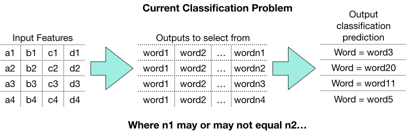

# Predicting the Description of a Strange Planet Cartoon
This is the analysis I used to create this [blog post](https://towardsdatascience.com/an-analysis-of-the-strange-planet-comic-series-56410af3a5b1). The blog post goes in to great detail about the EDA used to create the model, as I had hoped to find signal through the noise exploring any variable that might be relevant. A few examples of this EDA are shown below: 

My intention was to create a model that could predict the description of a strange planet cartoon given the text of the entire cartoon. This proved to be substantially more difficult than I had expected, and my model ended up have 0% accuracy relative to ~4% accuracy that could be achieved through random guessing. 

One aspect that made this challenging was that this model needed to give a probability of being the descriptive word to every word in the comic, then predict that the description of that comic was the word with the highest probability. 

#### Next Steps
One tool that I did not incorporate that might prove useful is Word2Vec. At the time of the post, I did not have a great idea how to compare the word to the sentence, but this is something I would like to look in to with a better idea of how to do so. 
